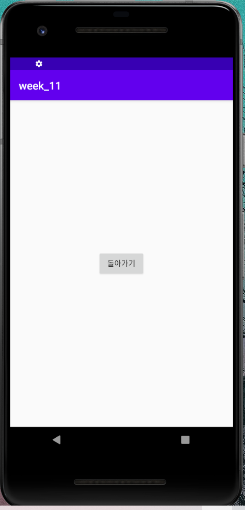
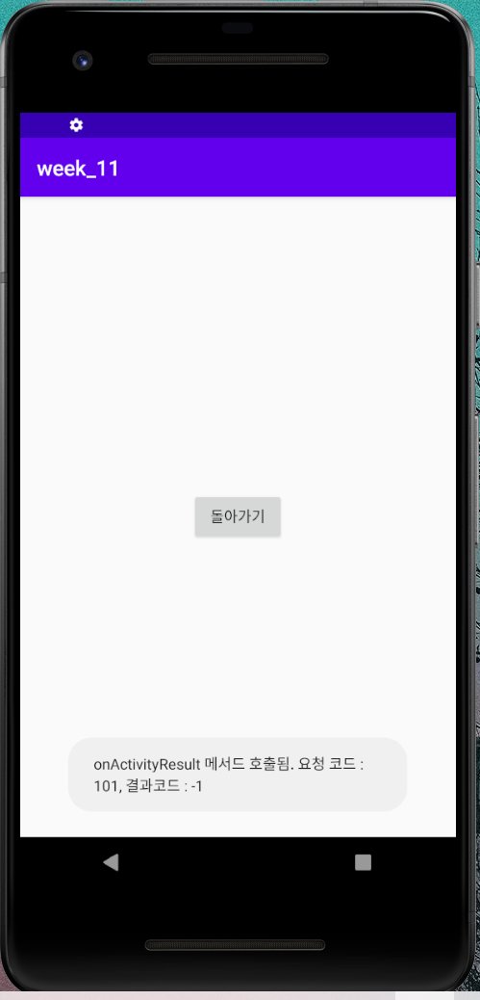

# 19173015 박소희

## 1주차 과제

## 2주차 과제
</img>

## 3주차 과제
</img>

## 4주차 과제
    - 앱 이름 : Travel now
    - 이름 뜻 : 여행 애플리케이션으로 '여행'이라는 단어를 직관적으로 표현한 이름
    - 설명 : 국내 여행 관련 애플리케이션으로 여행 스타일이나 계절에 따라 여행코스, 액티비티, 맛집 등을 추천해주고, 더불어 그 지역의 숙소까지 예약할 수 있도록 하는 종합 애플리케이션
    - 목적 : 사람들이 국내 여행을 할 때 필요한 것들을 종합적으로 제공하여, 여행할 때 이 애플리케이션으로 모든 것을 해결할 수 있도록 하는 서비스
    - 장점 : 1) 여행지까지의 최단 거리와 최저가격으로 갈 수 있는 교통정보를 제공
             2) 숙소를 선택 시 그 지역의 숙소(호텔, 펜션, 모텔 등)를 최저가로 비교해주고 예약할 수 있는 서비스 제공
             3) 여행 중에도 애플리케이션을 사용할 수 있도록 지도 서비스와 더불어 맛집이나 카페 등을 나타내고 사람들이 많이 찾은 곳을 표시하여 쉽게 찾아갈 수 있도록 함

## 7주차 과제
</img>
</img>

## 9주차 과제
</img>
</img>
</img>
</img>
</img>
</img>

## 10주차 과제
</img>

## 11주차 과제
</img>
</img>
</img>
</img>
